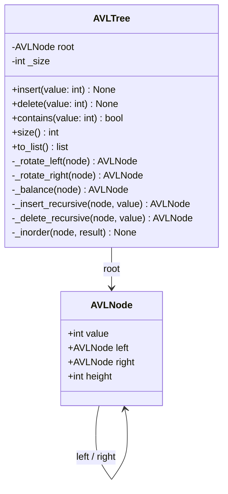

# Geordnete Menge – Anforderungen und UML-Diagramm

## Beschreibung
Eine Geordnete Menge ist eine Datenstruktur, die Elemente sortiert speichert.
Jedes Element kommt nur einmal vor (Mengeneigenschaft).
Der AVL-Baum garantiert O(log n) für Einfügen, Suchen und Löschen durch Balancierung.

## Nebenbedingungen
- Höhenbalanciert: |Höhe(links) - Höhe(rechts)| <= 1 für jeden Knoten
- Alle Elemente müssen vergleichbar sein (z.B. Zahlen, Strings)
- Keine Duplikate erlaubt
- Einfügen, Suchen und Löschen in O(log n)

## Operationen
| Operation   | Beschreibung                        | Laufzeit |
|-------------|-------------------------------------|----------|
| insert(x)   | Fügt Element x ein                  | O(log n) |
| delete(x)   | Entfernt Element x                  | O(log n) |
| contains(x) | Prüft ob x enthalten ist            | O(log n) |
| size()      | Gibt Anzahl der Elemente zurück     | O(1)     |
| to_list()   | Gibt sortierte Liste aller Elemente | O(n)     |

## UML-Klassendiagramm

